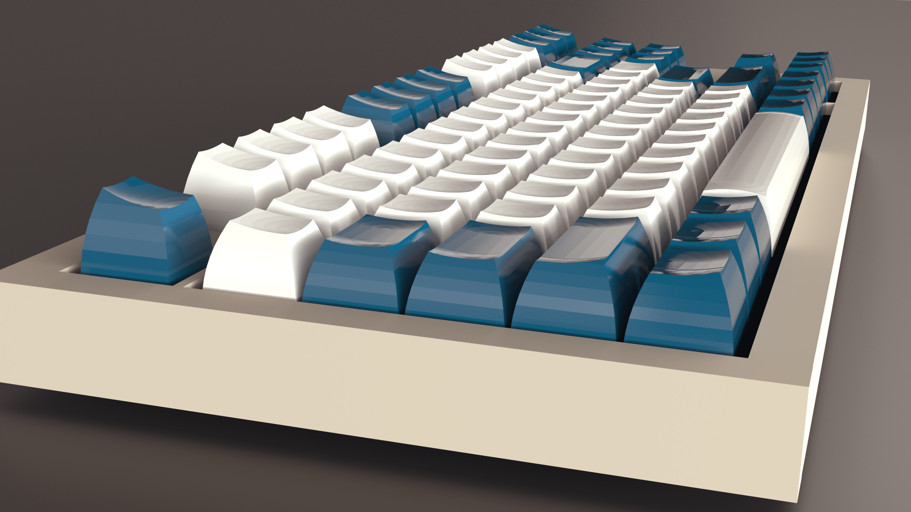
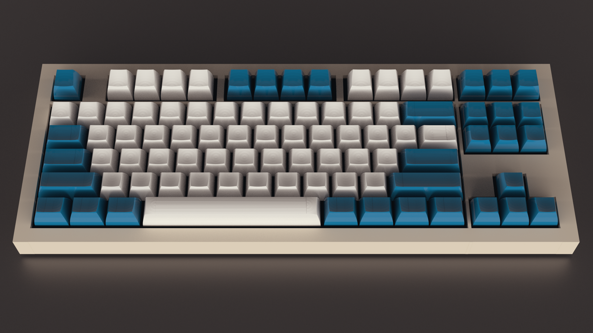
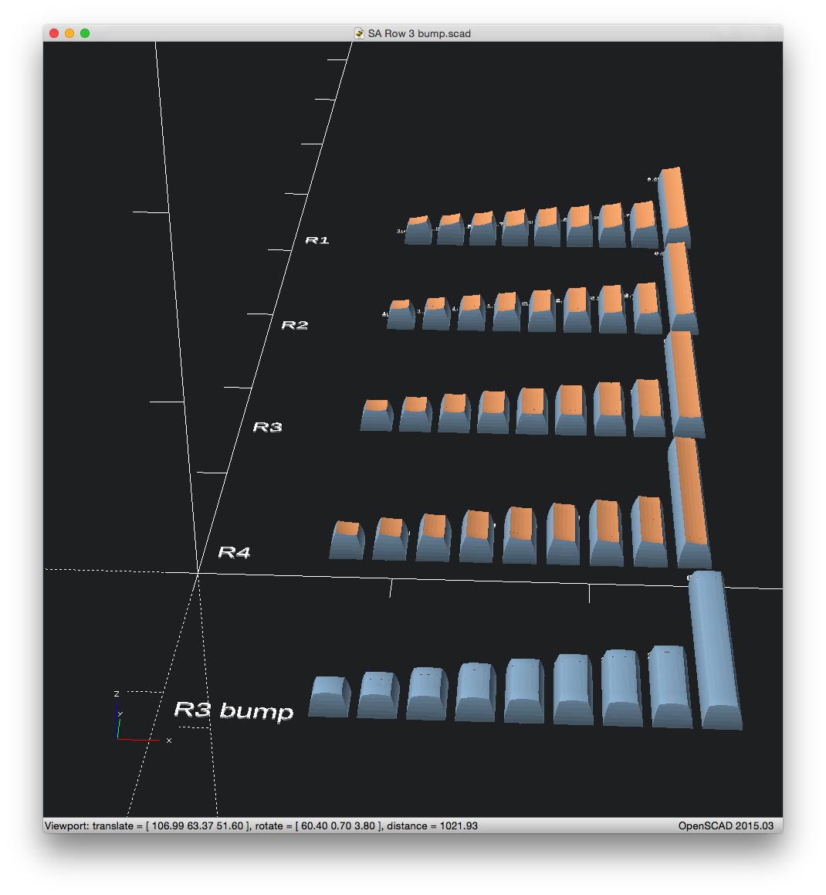

# SA Profile Keys 3D models

This repo contains a set of OpenSCAD, SVG planning drawings and a
Blender Scene with TKL layout, to help you plan keyboard layouts and
colorways for Signature Plastics SA profile key caps.

The main files you will be interested in are:

- [.blend scene](https://github.com/getclacking/SA-profile-keys-3D-models/blob/master/SA-profile-TKL-and-keys.blend)
- [openscad CSG](https://github.com/getclacking/SA-profile-keys-3D-models/blob/master/SA%20Combined.scad)

You can do funky stuff like this with the key models... (the TKL layout is already included)

You will find a complete set of keys 1u - 2.75u + 6.25u spacebars in
all SA row profiles. (R1-R4 + R3 'bump' e.g. for spacebars etc.)

The models are relatively low poly, [you will get nice rounded keys if you wrap them with a polysphere.](http://blender.stackexchange.com/a/42245/19768)

- There are plans to:
    - Add Signature plastics ABS colors as materials.
    - Add more interesting scene setup.
    - Add a proper keyboard design, instead of the glued together cuboids.

- Currently there are no plans to:
    - L or J shape keys (ISO Enter, Big Ass Enter etc.)
    - Stepped keys (e.g. Caps Lock etc.)
    - Custom space bar sizes, look at the SCAD code to see how the
      6.25 was constructed, I will answer technical stuff in the
      issues page on this repo
    - Stems to fit actual switches (there won't be in this project either.)
    - Make this 3D print ready in any other way
    - Add Signature plastics PBT colors as materials (since SP don't produce SA in PBT, currently)

These files and models are freely available under the MIT License, you may do what you like with them.

At this time, I don't consider them useful for straight-to-3d-print,
of course you are free to prep-them and add Cherry, ALPS or Topre
stems to the models as you see fit.

### Dirty sandpit work in progress notes and image and stuff

Just some shots of these being built...

Work in progress

Initial work SA Row 3 1u (in error. The sides are not spherical chords, they are cylindrical chords.)

Test render all SA R3 1u: (Blender Cycles renderer is pretty nice)

Rows 1,2,3 as SCAD

Row 4 is R2 flipped

Now working on the 1.25, 1.5, 1.75, 2, 2.25 etc. keys (plus a 6.25 spacebar)

### OpenSCAD - notes on the language

Just a quick side note re: OpenSCAD, it's language is quite bad, and
(despite notes in the manual to the contrary) it's not functional, no
first class functions, even anonymous functions or function refs
etc. are not possible, so the code is more copy paste than I'd
normally tolerate.

Matt Adereth's Dactly Cave project wraps openscad in a clojure
wrapper, but pretty much any modern language can be used to generate
scad files better than writing them by hand.  I wish I'd taken more
notice of Matt's warnings about the language before, however, 170
lines of code, isn't too much trouble.

I would probably use a macro/templating preprocessor in any larger
uses of scad.  However, despite this it's a pretty useful tool all the same.
